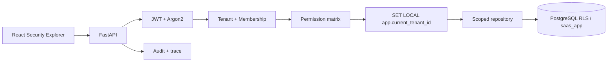
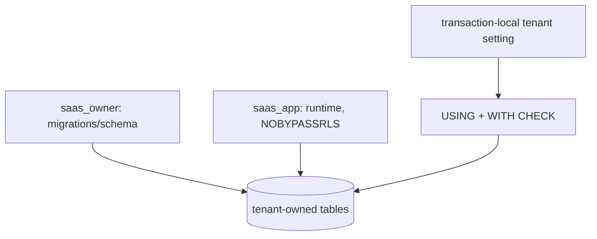
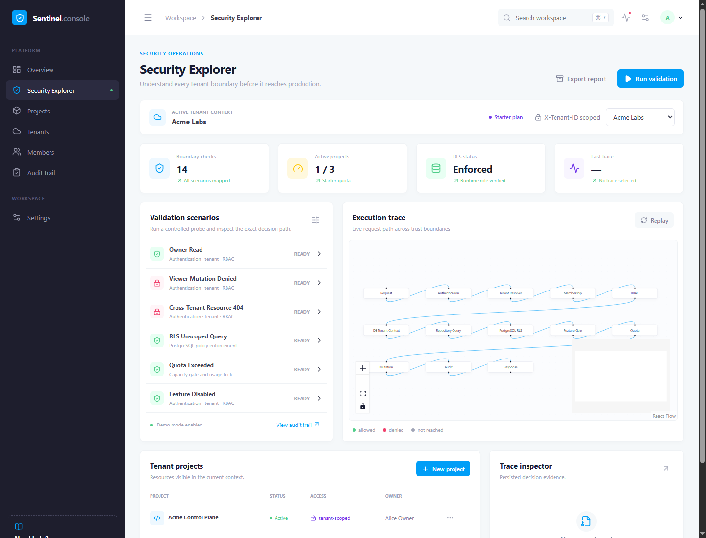

# Multi-Tenant SaaS Platform

A reference implementation of tenant isolation with explicit tenant resolution, membership-aware RBAC, PostgreSQL row-level security, quotas, feature gates, audit logging, and a visual security explorer.

> This project treats `X-Tenant-ID` as a request selector, never as proof of authorization. The server resolves the tenant and role from the database on every request, then applies application scoping and PostgreSQL RLS.

## Architecture





## Security guarantees demonstrated

| Concern | Failure risk | Implementation |
| --- | --- | --- |
| Authentication | Unknown actor | Local JWT + Argon2 |
| Tenant selection | Header tampering | Membership validation |
| Authorization | Role escalation | Central permission matrix |
| Data isolation | Missing tenant predicate | PostgreSQL RLS |
| IDOR | Known foreign UUID | Tenant scope + 404 |
| Quotas | Plan overuse | Transactional capacity gate |
| Feature access | Wrong capability | Plan default + tenant override |
| Audit | No accountability | Append-only application events |

### Tenant resolution and authorization

The JWT authenticates a user only. `X-Tenant-ID` requests a tenant. The API loads that tenant, checks active membership, derives the role and permissions server-side, and creates an immutable request context. Roles are deliberately not authoritative JWT claims because memberships can change after token issuance.

Roles are fixed: `owner`, `admin`, `member`, `viewer`. Owner has all permissions; admin has all except project deletion; member can read/create/update projects and read features; viewer is read-only.

### RLS boundary

Migrations run as `saas_owner`; the application connects as `saas_app`, a non-superuser without `BYPASSRLS`. Tenant-owned tables use `USING` and `WITH CHECK` against `current_setting('app.current_tenant_id', true)`. The setting is applied with `set_config(..., true)` inside the transaction, so pooled connections cannot retain a tenant context. Missing context returns no tenant rows. The fixed unscoped probe intentionally omits an application predicate to prove database enforcement.

Application RBAC answers “may this member perform this operation?” RLS answers “which rows can this database session see/change?”. RLS is defense in depth; PostgreSQL owners/superusers can bypass policies, which is why the runtime role is separate.

## Local execution

Install PostgreSQL 16+ natively and create a database named `saas_demo`. Run `scripts/bootstrap-postgres.sql` once as a PostgreSQL superuser, then configure the two connection URLs from `.env.example` (or run `scripts/setup-postgres.ps1`).

```powershell
cd backend
python -m venv .venv
.\.venv\Scripts\Activate.ps1
pip install -e ".[dev]"
alembic upgrade head
python -m app.seed
uvicorn app.main:app --reload
```

In a second terminal:

```powershell
cd frontend
npm install
npm run dev
```

Demo users all use `demo-password`: `alice@demo.local` (Acme owner), `bob@demo.local` (Acme member), `vera@demo.local` (Acme viewer), `carol@demo.local` (Globex owner), and `sam@demo.local` (Acme admin + Globex member).

## Isolation lab

Use the UI or API to run the fixed scenarios: viewer mutation denial, tenant-header tampering, known foreign UUID returning 404, an unscoped RLS query returning only current-tenant rows, quota exhaustion, and feature denial. No arbitrary SQL or attack script is accepted. Probe endpoints require `DEMO_MODE=true` and a seeded authenticated user.

## Validation

```powershell
cd backend
ruff check .
pytest
python -m app.evaluation.run
cd ..\frontend
npm run lint
npm run build
```

## Screenshots

The screenshots are real captures from the running Vite application, never mockups. Scenario captures must be taken after the native PostgreSQL backend is running so the trace inspector contains persisted evidence.



The capture shows the Sentinel console layout: fixed navigation, workspace toolbar, tenant context, KPI widgets, controlled security lab, XYFlow request canvas, project table, trace inspector, and replay control.

## What this is not

Not Auth0/Keycloak, billing, a full SaaS starter, generic IAM/policy-as-code, production MFA/session management, a penetration-testing toolkit, microservices, or Kubernetes. Local JWT, seeded plan tiers, one database/region, and application-convention append-only audit are intentional demo trade-offs.

## Roadmap

| Phase | Cards | Outcome |
| --- | --- | --- |
| Foundation | MTS-001–005 | Git, native PostgreSQL, FastAPI/React, Alembic schema |
| Trust boundaries | MTS-006–011 | Argon2/JWT, tenant context, membership, roles, runtime DB role, RLS |
| SaaS controls | MTS-012–020 | Projects, RBAC, quotas, features, audit, traces, probes, evaluation |
| Explorer UX | MTS-021–026 | Dashboard, flow templates, XYFlow canvas, inspector, timeline, replay |
| Delivery | MTS-027–028 | CI, threat model, docs, screenshots, release review |

Detailed decisions and threat model live in [`docs/`](docs/).

Docker is intentionally not part of the local workflow. PostgreSQL remains mandatory because SQLite cannot execute or prove the required RLS policies. The evaluation dataset contains the 14 security scenarios required by the master specification.
